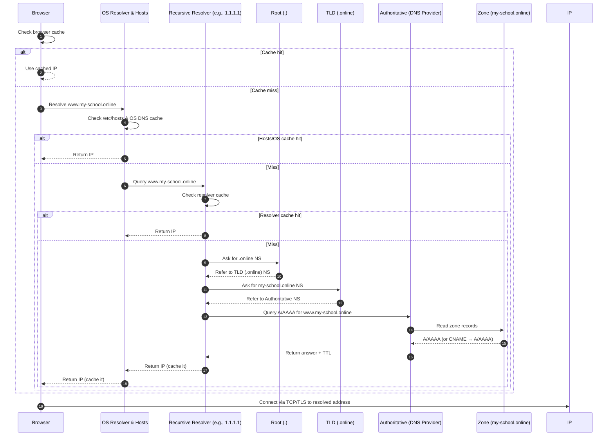

# dns
- [coredns](https://github.com/samitkumarpatel/coredns)
- [azure dns Zone]()
- [aws Route 53]()

# DNS Resolution — How a Name Gets Resolved

This README explains, step-by-step, how `www.my-school.online` is resolved to an IP address. It covers browser/OS caches, `/etc/hosts`, recursive DNS resolvers, root/TLD/authoritative name servers, and the DNS zone at your DNS provider.

---

## 🔁 Resolution Order (High Level)

1. **Browser cache** → (if hit, done)
2. **OS path**  
   a) `/etc/hosts` (or `C:\Windows\System32\drivers\etc\hosts`)  
   b) OS DNS cache (e.g., `systemd-resolved`, Windows DNS Client)
3. **Recursive resolver** (ISP/8.8.8.8/1.1.1.1)  
   a) Resolver cache  
   b) If miss, do full recursion:
      - Ask **Root** (.)
      - Ask **TLD** (`.online`)
      - Ask **Authoritative** (at your DNS provider, e.g., GoDaddy)
4. **Authoritative nameserver** reads the **zone file** for `my-school.online` and returns `A/AAAA` (or `CNAME → A/AAAA`).
5. IP bubbles back: Authoritative → Resolver (caches) → OS (caches) → Browser (caches) → App connects to IP.

---

## 🗺️ Mermaid Sequence (paste into GitHub/VS Code that supports Mermaid)

